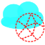
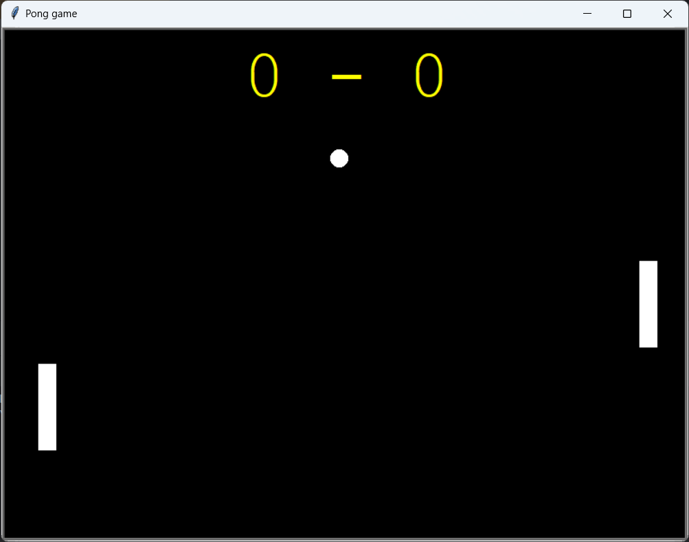
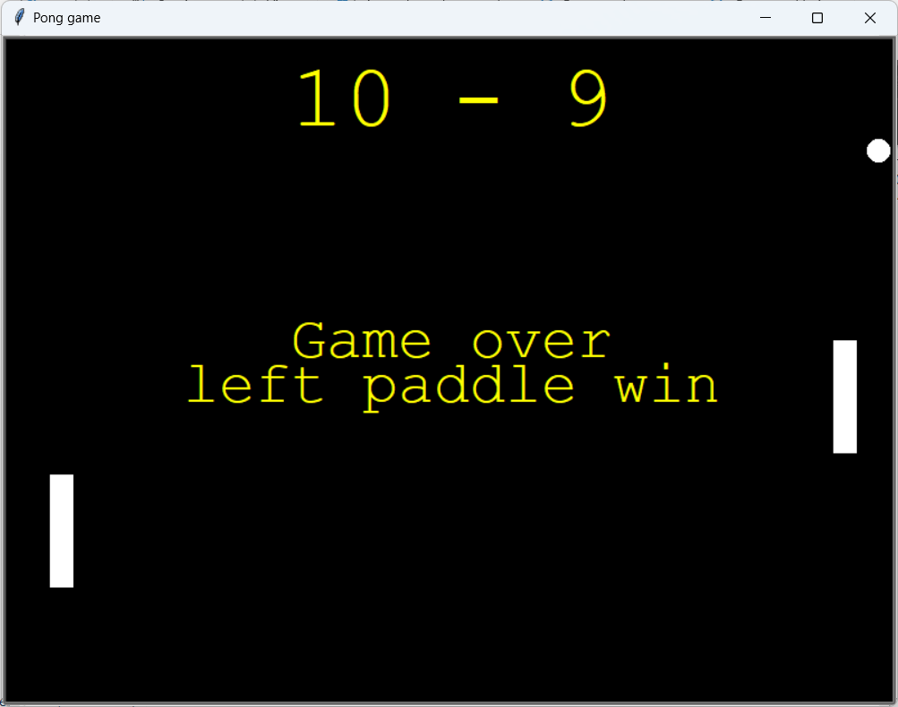

[![Contributors][contributors-shield]][contributors-url]
[![Forks][forks-shield]][forks-url]
[![Stargazers][stars-shield]][stars-url]
[![Issues][issues-shield]][issues-url]
[![MIT License][license-shield]][license-url]
[![LinkedIn][linkedin-shield]][linkedin-url]


<!-- PROJECT LOGO -->
<br />
<div align="center">
    <a href="https://github.com/TirsvadGUI/Python.Game.Pong">
        
    </a>
    <h3 align="center">Pong</h3>
    <p align="center">
        This game is developed in python script.
        <br />
        Pong is one of the first computer games that ever created. The game was originally developed by Allan Alcorn and released in 1972 by Atari corporations.
        <br />
        Read more about pong <a href="https://en.wikipedia.org/wiki/PONG">here</a>
        <br />
        <br />
        <a href="https://github.com/TirsvadGUI/Python.Game.Pong/blob/main/images/screenshot01.png">
            
        </a>
        <a href="https://github.com/TirsvadGUI/Python.Game.Pong/blob/main/images/screenshot02.png">
            
        </a>
        <br />
        <a href="https://github.com/TirsvadGUI/Python.Game.Pong"><strong>Explore the docs »</strong></a>
        <br />
        <br />
        <a href="https://github.com/TirsvadGUI/Python.Game.Pong/issues/new?labels=bug&template=bug-report---.md">Report Bug</a>
        ·
        <a href="https://github.com/TirsvadGUI/Python.Game.Pong/issues/new?labels=enhancement&template=feature-request---.md">Request Feature</a>
    </p>
</div>


# Pong
Classic Pong game written in python

Two player game where left paddle uses 'w' for up and 's' for down and right paddle uses arrow up and arrow down

# Getting Started
This is an example of how you may give instructions on setting up your project locally. To get a local copy up and running follow these simple example steps.

## Prerequisites
You have python3 installed.

## Installation
In a terminal do following

```console
mkdir Pong
curl -L https://api.github.com/repos/TirsvadGUI/Python.Game.Pong/tarball | tar -xz --strip-components=3 -C Pong
```

For play the game go to the folder Pong and run game.
It saves high scores and player name.

```commandline
cd Pong
python main.py
```

Use arrow keys for moving the Pong

## Contributing

Contributions are what make the open source community such an amazing place to learn, inspire, and create. Any contributions you make are greatly appreciated.

If you have a suggestion that would make this better, please fork the repo and create a pull request. You can also simply open an issue with the tag "enhancement". Don't forget to give the project a star! Thanks again!

Fork the Project

<ol>
    <li>Fork the Project</li>
    <li>Create your Feature Branch</li>
    <li>Commit your Changes</li>
    <li>Push to the Branch</li>
    <li>Open a Pull Request</li>
</ol>

Example

```commandline
git checkout -b feature
git commit -m 'Add my feature enhance to project'
git push origin feature
```

<!-- MARKDOWN LINKS & IMAGES -->
<!-- https://www.markdownguide.org/basic-syntax/#reference-style-links -->
[contributors-shield]: https://img.shields.io/github/contributors/TirsvadGUI/Python.Game.Pong?style=for-the-badge
[contributors-url]: https://github.com/[github-repo]/graphs/contributors
[forks-shield]: https://img.shields.io/github/forks/TirsvadGUI/Python.Game.Pong?style=for-the-badge
[forks-url]: https://github.com/TirsvadGUI/Python.Game.Pong/network/members
[stars-shield]: https://img.shields.io/github/stars/TirsvadGUI/Python.Game.Pong?style=for-the-badge
[stars-url]: https://github.com/TirsvadGUI/Python.Game.Pong/stargazers
[issues-shield]: https://img.shields.io/github/issues/TirsvadGUI/Python.Game.Pong?style=for-the-badge
[issues-url]: https://github.com/TirsvadGUI/Python.Game.Pong/issues
[license-shield]: https://img.shields.io/github/license/TirsvadGUI/Python.Game.Pong?style=for-the-badge
[license-url]: https://github.com/TirsvadGUI/Python.Game.Pong/blob/master/LICENSE.txt
[linkedin-shield]: https://img.shields.io/badge/-LinkedIn-black.svg?style=for-the-badge&logo=linkedin&colorB=555
[linkedin-url]: https://www.linkedin.com/in/jens-tirsvad-nielsen-13b795b9/
